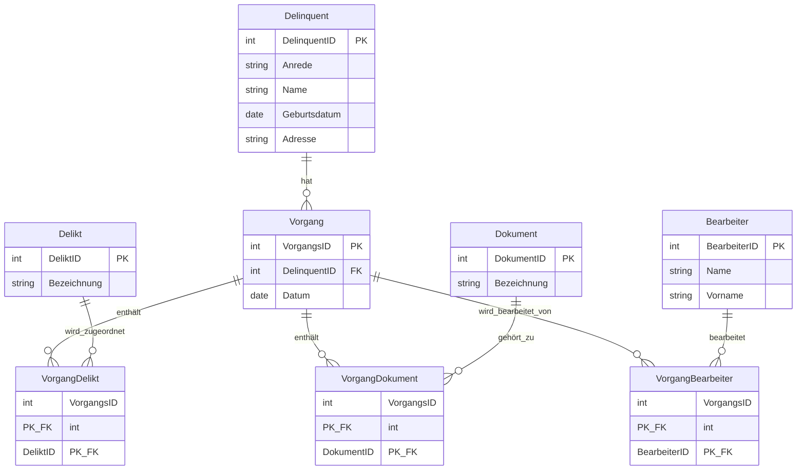

# Musterlösungen - Klausur 3. Ausbildungsjahr IT23

## Aufgabe 1: Datenbank Ermittlungsverfahren (25 Pkt.)

### Relationales Datenmodell (3. Normalform)

**Tabelle: Delinquent**
- DelinquentID (PK)
- Anrede
- Name
- Geburtsdatum
- Adresse

**Tabelle: Vorgang**
- VorgangsID (PK)
- DelinquentID (FK)
- Datum

**Tabelle: Delikt**
- DeliktID (PK)
- Bezeichnung

**Tabelle: Dokument**
- DokumentID (PK)
- Bezeichnung

**Tabelle: Bearbeiter**
- BearbeiterID (PK)
- Name
- Vorname

**Tabelle: VorgangDelikt** (Zwischentabelle für m:n-Beziehung)
- VorgangsID (PK, FK)
- DeliktID (PK, FK)

**Tabelle: VorgangDokument** (Zwischentabelle für m:n-Beziehung)
- VorgangsID (PK, FK)
- DokumentID (PK, FK)

**Tabelle: VorgangBearbeiter** (Zwischentabelle für m:n-Beziehung)
- VorgangsID (PK, FK)
- BearbeiterID (PK, FK)

### Beziehungen und Kardinalitäten:
- Delinquent (1) ↔ (n) Vorgang
- Vorgang (n) ↔ (m) Delikt
- Vorgang (n) ↔ (m) Dokument  
- Vorgang (n) ↔ (m) Bearbeiter

**Begründung 3. Normalform:**
- 1. NF: Alle Attribute sind atomar (keine Wiederholungsgruppen)
- 2. NF: Alle Nicht-Schlüssel-Attribute sind voll funktional abhängig vom Primärschlüssel
- 3. NF: Keine transitiven Abhängigkeiten zwischen Nicht-Schlüssel-Attributen



---

## Aufgabe 2: SQL-Abfragen (18 Pkt.)

### a) Ermittlungsverfahren mit Personen- und Deliktdaten (6 Pkt.) - In Bewertung bei Fehlern von 6 Pkt. abziehen

```sql
SELECT 
    v.VorgangsID,
    p.Nachname,
    p.Vorname,
    d.Bezeichnung AS Delikt,
    v.DatumVon,
    v.DatumBis
FROM Vorgang v
JOIN Person p ON v.PersonID = p.PersonID
JOIN Zuordnung z ON v.VorgangsID = z.VorgangsID
JOIN Delikt d ON z.DeliktID = d.DeliktID
ORDER BY p.Nachname ASC, d.Bezeichnung ASC;
```

### b) Vorgänge mit Bearbeiter- und Dokumentdaten (6 Pkt.) - In Bewertung bei Fehlern von 6 Pkt. abziehen

```sql
SELECT 
    v.VorgangsID,
    v.DatumVon,
    v.DatumBis,
    b.Nachname AS BearbeiterNachname,
    b.Vorname AS BearbeiterVorname,
    dok.Bezeichnung AS Dokument
FROM Vorgang v
LEFT JOIN Zuordnung z ON v.VorgangsID = z.VorgangsID
LEFT JOIN Bearbeiter b ON z.BearbeiterID = b.BearbeiterID
LEFT JOIN Dokument dok ON z.DokumentID = dok.DokumentID
ORDER BY v.VorgangsID;
```

### c) Anzahl Ermittlungsverfahren pro Delikt (6 Pkt.) - In Bewertung bei Fehlern von 6 Pkt. abziehen

```sql
SELECT 
    d.Bezeichnung AS Delikt,
    COUNT(z.VorgangsID) AS AnzahlVerfahren
FROM Delikt d
LEFT JOIN Zuordnung z ON d.DeliktID = z.DeliktID
GROUP BY d.DeliktID, d.Bezeichnung
ORDER BY AnzahlVerfahren DESC;
```

---

## Aufgabe 3: Bearbeitungszeiten optimieren - Algorithmus (25 Pkt.)  - In Bewertung bei Fehlern von 25 Pkt. abziehen

### Pseudocode für ermittleVerzoegerungen()

```code
FUNKTION ermittleVerzoegerungen(zeiten: Bearbeitungszeit[]): Integer[]
BEGINN
    // Array für Verzögerungen initialisieren (15 Schritte)
    verzoegerungen: Integer[15] ← [0,0,0,0,0,0,0,0,0,0,0,0,0,0,0]
    
    // Alle Daten nach Datum und Schritt sortieren
    SORTIERE zeiten NACH (datum, schrittNr)
    
    // Durch alle Einträge iterieren
    FÜR i ← 0 BIS LÄNGE(zeiten) - 2
        aktuellerEintrag ← zeiten[i]
        naechsterEintrag ← zeiten[i + 1]
        
        // Prüfen ob aufeinanderfolgende Schritte am gleichen Tag
        WENN aktuellerEintrag.getDatum() = naechsterEintrag.getDatum() UND
             naechsterEintrag.getSchrittNr() = aktuellerEintrag.getSchrittNr() + 1 DANN
        BEGINN
            // Tatsächliche Bearbeitungsdauer berechnen
            istDauer ← naechsterEintrag.getIstBearbeitung() - aktuellerEintrag.getIstBearbeitung()
            
            // Geplante Bearbeitungsdauer berechnen  
            planDauer ← naechsterEintrag.getPlanBearbeitung() - aktuellerEintrag.getPlanBearbeitung()
            
            // Verzögerung berechnen
            verzoegerung ← istDauer - planDauer
            
            // Prüfen ob Verzögerung > 2 Minuten
            WENN verzoegerung > 2 DANN
                schrittIndex ← naechsterEintrag.getSchrittNr() - 1
                verzoegerungen[schrittIndex] ← verzoegerungen[schrittIndex] + 1
            ENDE WENN
        ENDE
    ENDE FÜR
    
    RÜCKGABE verzoegerungen
ENDE
```

### Erklärung des Algorithmus:
1. **Initialisierung**: Array für 15 Bearbeitungsschritte mit 0 initialisieren
2. **Sortierung**: Daten nach Datum und Schrittnummer sortieren
3. **Iteration**: Durch alle Einträge gehen und aufeinanderfolgende Schritte vergleichen
4. **Berechnung**: Tatsächliche und geplante Bearbeitungsdauer ermitteln
5. **Verzögerungsprüfung**: Wenn Unterschied > 2 Minuten, Zähler erhöhen

---

## Aufgabe 4: Datenformate und Datenaustausch (14 Pkt.)

### a) XML zu JSON Konvertierung (5 Pkt.) - In Bewertung bei Fehlern von 5 Pkt. abziehen

```json
{
  "bestellung": {
    "id": "1001",
    "kunde": {
      "name": "Anna Müller",
      "email": "anna.mueller@polizei.de"
    },
    "produkte": [
      {
        "artikelnummer": "P789",
        "anzahl": 2,
        "preis": 49.90
      },
      {
        "artikelnummer": "P123", 
        "anzahl": 1,
        "preis": 89.50
      }
    ],
    "versand": {
      "adresse": "Musterstraße 12, 12345 Berlin",
      "prioritaet": "normal"
    }
  }
}
```

### b) XML-Dokument erstellen (5 Pkt.) - In Bewertung bei Fehlern von 5 Pkt. abziehen

```xml
<?xml version="1.0" encoding="UTF-8"?>
<lieferant id="LS007">
  <name>TechSupply GmbH</name>
  <email>info@techsupply.de</email>
  <artikel>
    <produkt artikelnummer="A1001">
      <bezeichnung>USB-C Kabel 2m</bezeichnung>
      <lagerbestand>150</lagerbestand>
      <preis currency="EUR">12.99</preis>
    </produkt>
    <produkt artikelnummer="A1002">
      <bezeichnung>Mechanische Tastatur</bezeichnung>
      <lagerbestand>35</lagerbestand>
      <preis currency="EUR">89.90</preis>
    </produkt>
  </artikel>
</lieferant>
```

### c) XML vs JSON - Bevorzugung von XML (4 Pkt.)

**1. Schema-Validation und Datenintegrität:**
XML unterstützt umfassende Schema-Validierung durch XSD (XML Schema Definition), die komplexe Datentypen, Constraints und Validierungsregeln ermöglicht. Dies ist besonders wichtig in kritischen Systemen wie Polizeidatenbanken, wo Datenintegrität essentiell ist.

**2. Namespace-Unterstützung für komplexe Systeme:**
XML bietet native Namespace-Unterstützung, die bei der Integration verschiedener Systeme (ERP, Lagerverwaltung, Ermittlungssoftware) hilft, Namenskonflikte zu vermeiden und eindeutige Elementidentifikation zu gewährleisten.

---

## Aufgabe 5: Design Pattern (5 Pkt.)

### Definition Design Pattern:
Ein **Design Pattern** ist eine bewährte, wiederverwendbare Lösung für wiederkehrende Entwurfsprobleme in der Softwareentwicklung. Es beschreibt eine allgemeine Struktur von Klassen und deren Interaktionen, um ein spezifisches Problem elegant und wartbar zu lösen. (2)

### Beispiel: Singleton Pattern (1)

**Zweck:** 
Das Singleton Pattern stellt sicher, dass von einer Klasse nur genau eine Instanz existiert und bietet einen globalen Zugriffspunkt darauf. (2)

**Anwendung in der Ermittlungssoftware:**
Eine `DatabaseConnection`-Klasse sollte nur einmal instanziiert werden, um Ressourcenverbrauch zu minimieren und Datenkonsistenz zu gewährleisten. Das Singleton Pattern verhindert mehrfache Datenbankverbindungen und stellt eine zentrale Verwaltung sicher.

**Implementierung:**
```java
public class DatabaseConnection {
    private static DatabaseConnection instance;
    
    private DatabaseConnection() {
        // Konstruktor privat
    }
    
    public static DatabaseConnection getInstance() {
        if (instance == null) {
            instance = new DatabaseConnection();
        }
        return instance;
    }
}
```

---

**Gesamtpunktzahl: 87 Punkte**